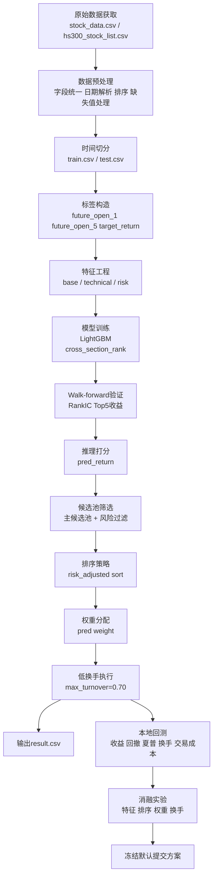

# 一页方法流程图

## 方法总流程

## 模块解释

### 1. 数据层

- 输入沪深300成分股历史行情数据和成分股清单
- 统一股票代码、日期和数值字段
- 按时间顺序构建训练集和本地验证集

### 2. 标签层

- 以未来开盘价构造监督学习目标
- 标签严格对应：
  - `T+1` 开盘买入
  - `T+5` 开盘卖出

### 3. 特征层

- 基础收益率与动量特征
- 技术指标与均线偏离特征
- 风险波动与横截面 rank 特征

### 4. 模型层

- 使用 `LightGBM` 作为主模型
- 训练目标为 `cross_section_rank`
- 用 `walk-forward` 验证稳定性

### 5. 策略层

- 先按预测值形成候选池
- 再做风险过滤
- 用风险调整排序选择股票
- 用风险调整权重分配仓位
- 用低换手执行压缩交易成本

### 6. 评估层

- 本地回测输出累计收益、回撤、夏普、换手率和成本后收益
- 通过消融实验验证：
  - 哪组特征最好
  - 哪种排序最好
  - 哪种权重最好
  - 哪个换手约束最好

## 当前冻结主线

当前项目主线已经固定为：

`数据预处理 -> 完整特征集 -> LightGBM排序训练 -> 风险调整排序 -> 预测值权重分配 -> 低换手执行 -> result.csv`
